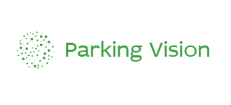
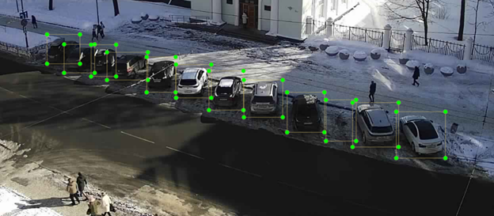
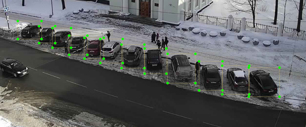
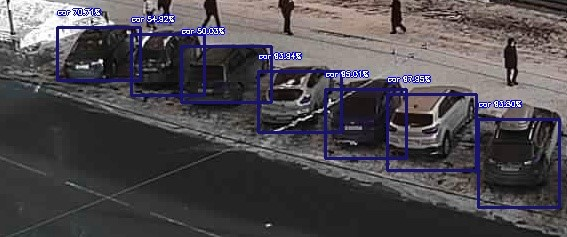
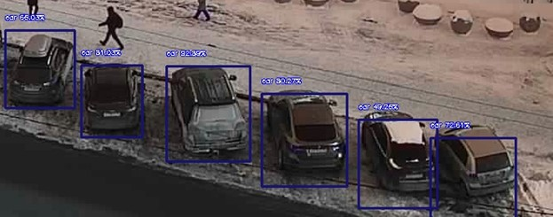
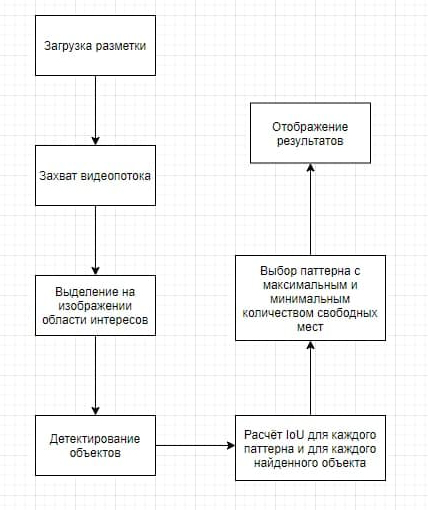
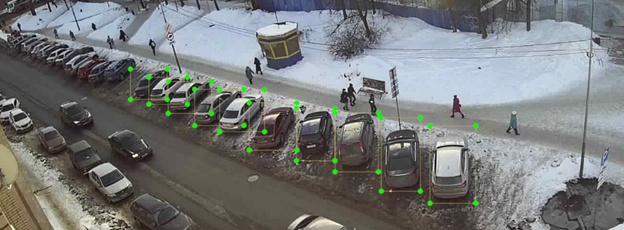

<h1 align="center">✨ Parking Vision ✨</h1>

  
 

<h2 align="center"><a target="_blank" href="http://89.20.57.27:5000/">Карта</a></h2>
<h2 align="center"><a target="_blank" href="http://89.20.57.27:5000/camera1">Развернутый сервис для парковки на пр. Ленина</a></h2>
<h2 align="center"><a target="_blank" href="http://89.20.57.27:5000/camera3">Развернутый сервис для парковки на ул. Анохина</a></h2>

## ***Навигация***
- [Описание](#описание)
- [Возможные неполадки](#возможные_неполадки)
- [Как пользоваться сервисом](#как_пользоваться)
- [Почему это работает?](#почему_это_работает)
- [О проекте и технологиях](#о_проекте_и_технологиях)
  - [Архитектура](#архитектура)
  - [Computer Vision & Machine Learning](#computer_vision_and_machine_learning)
  - ["Подводные камни"](#подводные_камни)
- [How to install](#how_to_install)

 
## ***Описание***

Сервис реализован для распознавания свободных мест на парковке автомобилей. Возможна поддержка в режиме "онлайн".
Пользователь сможет заранее проверить парковку на наличие и количество свободных мест при просмотре конкретного видеопотока.

При разработке сервиса были **учтены дорожные знаки**. Благодаря им было определено начало парковочной зоны (знак 🅿️) и не затронуты места только для инвалидов (знак ♿).

Парковка на пр. Ленина             |  Парковка на ул. Анохина
:-------------------------:|:-------------------------:
  |  

 
## ***Возможные неполадки***

При использовании сервиса возможно некорректное отображение парковочного места.

Пример некорректного отображения на парковке пр. Ленина
:-------------------------:

Баги, подобные тем, что изображены выше появляются по следующей причине:
- На данном этапе разработки сервис работает с использованием одной видеокарты и одной модели. Конкурентное обращение не разрешается.

**Решение проблемы:**

Смотреть запись сервиса с использованием **одного** потока. То есть, не запускать параллельно одну и ту же камеру с нескольких устройств.

 
## ***Как пользоваться сервисом***

**Перейти по ссылке с нужным номером камеры.**

  После нажатия на нужную ссылку - пользователь будет перенаправлен на web-страницу, где будет доступна информация о заполненности парковки. Предположительные свободные места будут отмечены **фиолетовым квадратом**.

 
## ***Почему это работает?***

Для того, чтобы запустить проект необходимо подготовить видео, которые будут обрабатываться. 
Проект поддерживает две камеры:

- Парковка на просп. Ленина с Мой Дом (camera1)
- Парковка на ул. Анохина с Мой Дом (camera3)

Видео должны быть переконвертированы с помощью ffmpeg следующей командой:

*Например, для camera1:* 

    ffmpeg -i camera_1.flv -c:v libx264 -crf 19 -vf fps=1/20 -strict experimental camera_1.mp4 
    
где 1/20 означает, что каждые 20 секунд будет взят 1 кадр

Помимо того, что для запуска необходимо установить зависимости из **requirements.txt** , нужно внести правки в **stream.py**:

    camera1_path = os.path.join(execution_path,"camera_1.mp4")
    camera3_path = os.path.join(execution_path,"camera_3.mp4")
    
Заменить эти строчки на пути к вашим файлам (или заменить файлы).

Так как github не разрешает заливать файлы > 100 mb, то нейросетевую модель придётся загрузить самостоятельно по ссылке:

https://github.com/OlafenwaMoses/ImageAI/releases/download/essentials-v5/resnet50_coco_best_v2.1.0.h5

и добавить в папку с проектом. 

Для того, что определить парковочные места были выбраны фотографии с максимальным (или почти максимальным) количеством автомобилей, которые могут быть припаркованы. Как уже было сказано ранее, были учтены дорожные знаки для определения начала парковочных мест. Также был учитана зона только для инвалидов, на нее не распространяются обычные парковочные места.

С помощью *labelimg* (пакет для python, часто использующийся при разметке изображений) были размечены парковочные места. Данная процедура повторялась для ~ 5- 10 изображений из набора данных. Данная процедура позволила получить набор паттернов расположения автомобилей для конкретной парковки.

  

  

Для улучшения качества распознавания объектов на основе *RetinaNet* на изображении были выделены области интересов (ROI), которые уже и подавались на вход нейронной сети:

  

  

  Для каждого парковочного места из каждого паттерна была рассчитана IoU между областью парковочного места и ограничивающим прямоугольником для машины. Затем IoU сравниваются с пороговым значением и для каждого паттерна становится известно количество свободных парковочных мест.
  
  Для отображения используются два режима: 
- с минимальным количеством свободных парковочных мест;
- с максимальным количеством свободных парковочных мест.

 
## ***О проекте и технологиях***

 
### Архитектура

 

 
### Computer Vision & Machine Learning

**Технонологии**:
- [OpenCV](https://opencv.org/)
- [ImageAI](http://www.imageai.org/)
- [ffmpeg](https://www.ffmpeg.org/)

 
### ***Подводные камни***

**Общая проблема** – это то, что использование детектора объектов в данной задачи не решают саму задачу. Большое количество машин, близко находящихся друг к другу, не позволяют детектору объектов функционировать в нормальном режиме. Даже если взять вместо *RetinaNet* что-то более «тяжелое», проблема останется.

**Основная идея** –изменить подход к решению задачи, избавившись от детектора объектов, а использовав только бинарный классификатор – это машина на парковочном месте или нет.

Камера c ул. Анохина имеет не совсем удачное расположение, так как машины на части парковки сливаются воедино, то вместо всей области парковки для определения свободных мест используется лишь часть.

  

  
Решение данной проблемы – видео более высокого разрешения или изменение угла обзора камеры (если она поворотная).

 
## ***How to install***

- Установить все зависимости для ImageAI:

https://github.com/OlafenwaMoses/ImageAI#installation

- Установить пакеты из requirements.txt:

  `pip install –r requirements.txt`
       
- Скачать  модель и добавить ее в папку проекта 

https://disk.yandex.ru/d/abwzNvzqsmM8Dg

- `python telegram_bot.py`
- `python stream.py`

- Для того, чтобы корректно отображалось количество машин на карте и приходили уведомления в Telegram, необходимо, чтобы ВСЕГДА была открыта одна вкладка с сервисом:
http://89.20.57.27:5000/camera1

- TG Bot: @ivisionpark_bot
##
 | 

